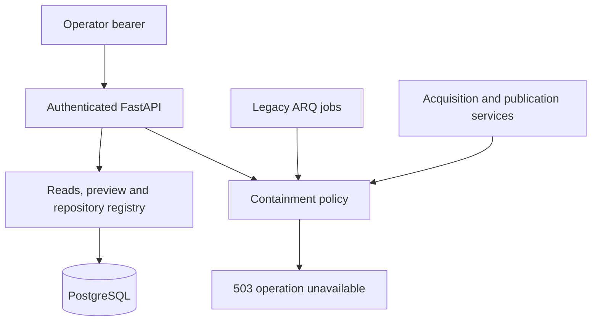
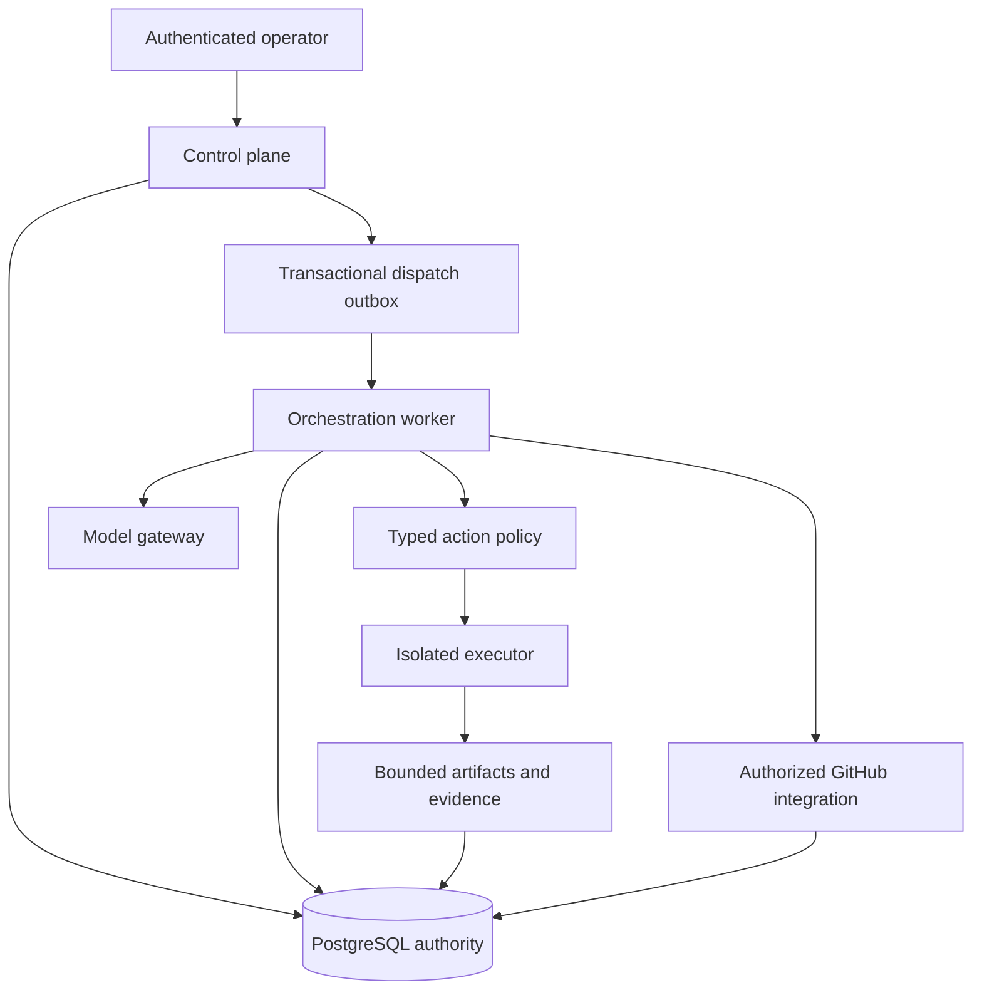
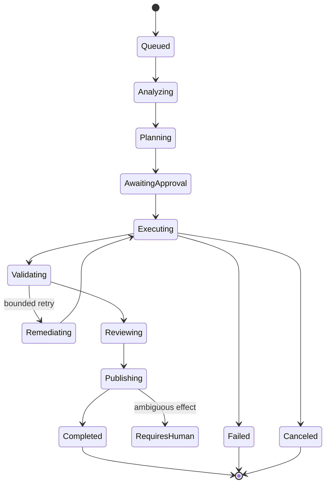

# ADWE architecture

## Product boundary

Target: controlled AI-assisted changes to explicitly registered repositories. Models propose;
the platform authorizes, executes and records. The product does not grant models host shell
access, automatically merge changes or let repository content redefine policy.

## CURRENT STATE

At the assessed baseline, the API writes four PostgreSQL tables and dispatches Redis/ARQ
jobs. A three-node in-memory LangGraph produces repository inventory, a plan and Markdown
patch proposals. Patch application, tests and publication are separate synchronous services.
There is no isolated execution plane or durable graph checkpoint store.

The first containment increment denies repository acquisition, host test execution, mutation
requests and publication. Offline planning on supplied inventory, diff preview, schema docs
and authenticated read endpoints remain available. This is a development containment mode, not
a production execution boundary. Single-operator API authentication and a PostgreSQL repository
registry are now implemented; runs do not yet bind these registrations. See SECURITY.md for the exact contract and residual risks.

## TARGET STATE — not yet implemented

A modular monolith with separate worker processes and isolated execution environments is
sufficient initially. Retain PostgreSQL, LangGraph and existing Redis/ARQ while measuring
operational needs. Logical planes are code/trust boundaries, not a demand for microservices.

| Plane | Responsibility | Authority / boundary |
| --- | --- | --- |
| Control | Authentication, repository registration, task/run APIs, policy, approvals, scheduling | Operator-owned policy and authenticated actor; durable writes to PostgreSQL |
| Orchestration | Step routing, bounded attempts, checkpoints, timeouts, recovery, budgets | Invokes only typed authorized capabilities; no raw model-to-tool execution |
| Execution | Checkout, read/search/patch, tests, snapshots and artifact collection | Untrusted workload; no platform credentials, host mounts or privileged runtime socket |
| Integration | GitHub App, model gateway, artifact storage and telemetry | Short-lived scoped credentials; verified request/response schemas and effect reconciliation |

## Authority and invariants

System/operator policy outranks authenticated task specifications. Repository content and
model output are untrusted data, including README/AGENTS files inside target repositories.
No content-derived instruction may change credentials, repository permissions, tools or budgets.

- Run binds repository identity, base SHA, task and policy version before analysis.
- A decision authorizes an exact operation/arguments digest, actor, run, revision and expiry.
- Approval binds the specific plan/changeset digest; changed inputs invalidate it.
- A worker atomically claims a step with an expiring lease and fencing generation. Stale
  workers cannot publish newer state or effects. DB constraints supplement application guards.
- Transactionally store state transition, attempt/evidence and audit event; enqueue via an
  outbox dispatcher. Duplicate deliveries must reobserve durable ownership/state.
- Terminal states never reopen implicitly. Explicit retry/resume creates traceable attempts.
- Publication requires required validations against the exact final changeset, explicit
  authorization and an effect intent. An uncertain response is reconciled, not blindly retried.
- Model/provider changes or fallback are explicit workflow policy choices, recorded in provenance.

## Durable execution design to implement

PostgreSQL is the authority for runs, steps, attempts, leases, decisions and effects. A
LangGraph checkpoint describes graph progress, not proof that an external effect happened.
Checkpoint/effect ordering needs an ADR and failure tests before an adapter is selected.
Keep graph nodes narrow; use bounded model/command calls and cancellation-aware execution.
Store final result only after all required steps and evidence are durable.

Representative target lifecycle (a design, not existing status values):

Before each state is implemented, specify entry guards, operation allowlist, outputs,
transaction boundary, timeout, retry category, next states and recovery behavior. Do not
introduce dozens of status values with no corresponding behavior.

## Data and compatibility strategy

Add normalized repository/revision/task, step/attempt, decision/approval and effect tables
incrementally with Alembic. Use JSONB for versioned model documents and bounded metadata,
not foreign keys or lifecycle fields. Reconcile orphaned legacy data before adding constraints.
Legacy APPLIED means either approved or applied; migration must not infer execution success
without evidence. Quarantine ambiguous records for review.

Maintain `/v1/workflows` contracts until versioned migration to runs is designed. Containment
503s are an intentional documented behavior change. Do not rename URLs merely to match a
reference architecture. All persisted schema changes require forward/backfill verification.

## Execution boundary and capacity assumptions

Initial scope: single operator, one control-plane deployment and bounded worker concurrency;
no claimed throughput or SLO. An executor must enforce CPU, RAM, PIDs, wall time, disk,
output and artifact quotas, network restrictions, symlink/path confinement and cleanup.
Use dedicated disposable hosts/strong workload isolation appropriate to the threat model;
a temp directory, command allowlist or ordinary app container alone is insufficient.

Collect queue latency, step duration, resource consumption, provider limits and artifact volume
before scaling. Redacted structured logs, bounded-cardinality metrics and propagated traces
support operations; append-oriented audit data supports investigation. These are distinct stores
with explicit retention and access controls. Neither is fully implemented today.

## Implemented increment: operator and repository admission

See ADR 001. Global FastAPI authentication covers data APIs, preview, health and metrics;
public docs contain schemas only. The operator identity is deployment-wide and grants access
to legacy data. `repositories` stores unique canonical GitHub URLs, registration actor,
enabled status and timezone-aware creation time. Registry mutations append actor-attributed
legacy audit rows in the same transaction. Unique inserts and row locks make concurrent
registration/state changes deterministic. No workflow-to-registry FK or revision model exists
yet. Repository permission enforcement at execution must precede lifting containment.

Application and migrations share DATABASE_URL; Alembic changes only the driver to psycopg.
Tests exercise PostgreSQL in isolated schemas; unit tests have no live DB dependency.
